<div align="center">

# Onyx

**Application de prise de notes**

[](https://laravel.com)
[](https://vuejs.org)
[](https://inertiajs.com)
[](https://tailwindcss.com)
[](https://php.net)
[](https://vitejs.dev)

</div>

---

## Présentation

Onyx est une application web de prise de notes inspirée d'Obsidian. Elle offre un éditeur Markdown complet avec aperçu en temps réel, des liens wiki entre notes, un graphe de connexions interactif, des callouts et des commandes slash — le tout dans une interface sobre et sombre.

Disponible en thème sombre et clair, entièrement responsive, Onyx est conçu pour organiser vos idées avec puissance et simplicité.

---

## Fonctionnalités

- **Éditeur Markdown** — Support complet : titres, gras, italique, listes, cases à cocher interactives, tableaux, blocs de code avec coloration syntaxique, séparateurs, citations et code inline
- **Aperçu en temps réel** — Bascule édition/aperçu par note, préférence mémorisée automatiquement
- **Liens wiki** — Créez des liens entre notes avec `[[titre]]`, naviguez d'une note à l'autre, consultez les backlinks et mentions non liées
- **Graphe de notes** — Carte visuelle interactive de toutes les connexions entre vos notes
- **Callouts** — Blocs info, tip, note, warning, success style Obsidian
- **Commandes slash** — Palette de commandes accessible avec `/` pour insérer des blocs rapidement (titres, listes, citation, cases à cocher…)
- **Images** — Insertion par drag & drop ou collage depuis le presse-papier (Ctrl+V), rendu dans l'aperçu
- **Tags** — Taguez vos notes et filtrez par tag
- **Recherche** — Recherche plein texte dans toutes vos notes
- **Arborescence** — Organisation hiérarchique des notes avec dossiers
- **Note du jour** — Ouvre ou crée automatiquement la note du jour
- **Templates** — Sauvegardez une note comme modèle réutilisable
- **Sommaire** — Navigation rapide vers les titres de la note en cours
- **Guide intégré** — Lexique de syntaxe complet et aperçu de démonstration
- **Multilingue** — Français, anglais, espagnol, allemand
- **Profil** — Langue, informations personnelles, mot de passe, suppression de compte
- **Administration** — Statistiques, gestion des utilisateurs, invitations, paramètres

---

## Aperçu

### Connexion

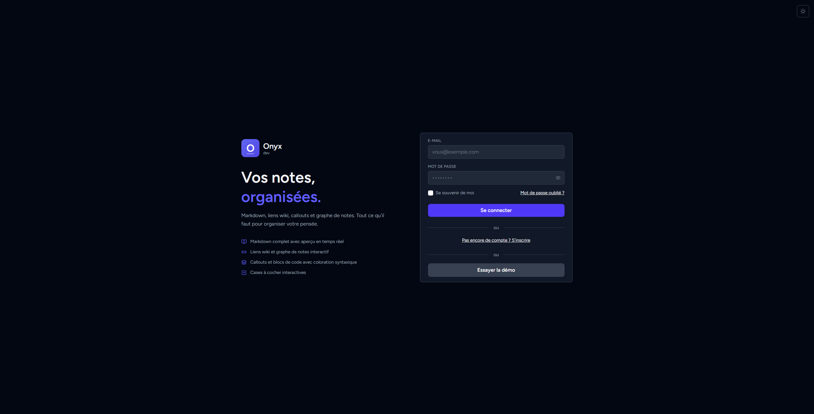

> Page de connexion en deux colonnes : présentation des fonctionnalités à gauche, formulaire à droite.

---

### Inscription

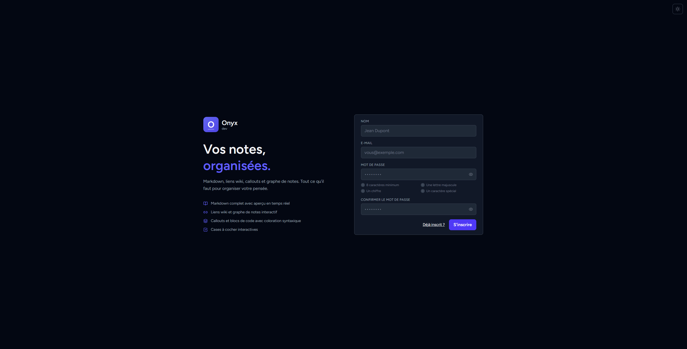

> Formulaire d'inscription : nom, e-mail, mot de passe et confirmation.

---

### Mot de passe oublié

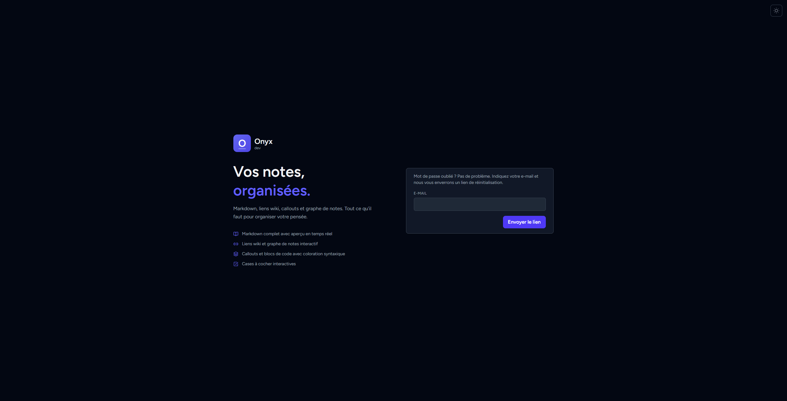

> Formulaire de réinitialisation du mot de passe : saisissez votre e-mail pour recevoir un lien de réinitialisation.

---

### Tableau de bord

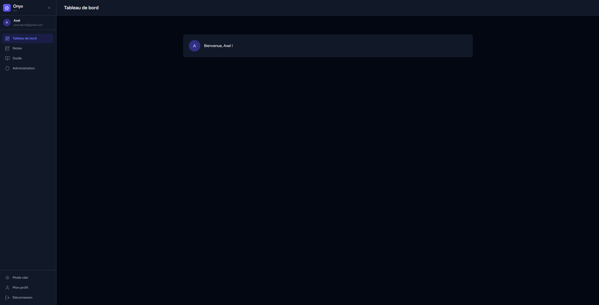

> Accueil personnalisé après connexion.

---

### Notes

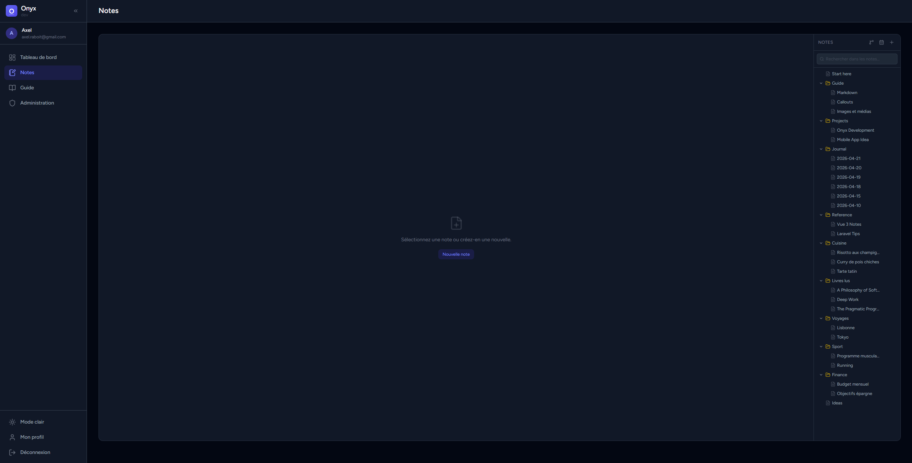

> Vue principale de l'espace notes : arborescence à droite, éditeur au centre, recherche et création rapide.

---

### Start here — liens wiki & callouts


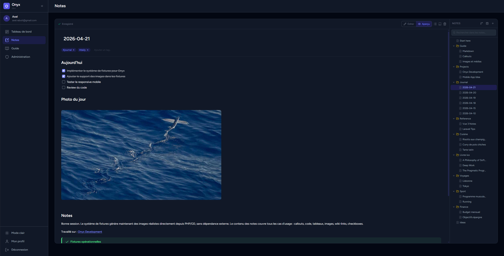

> Note d'index avec liens wiki `[[...]]` vers d'autres notes et callouts info/tip. En aperçu, les liens sont cliquables et les callouts colorés.

---

### Images

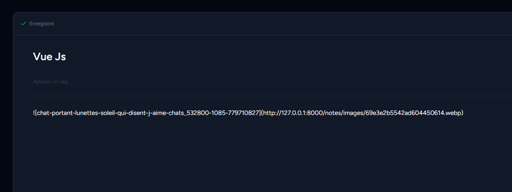

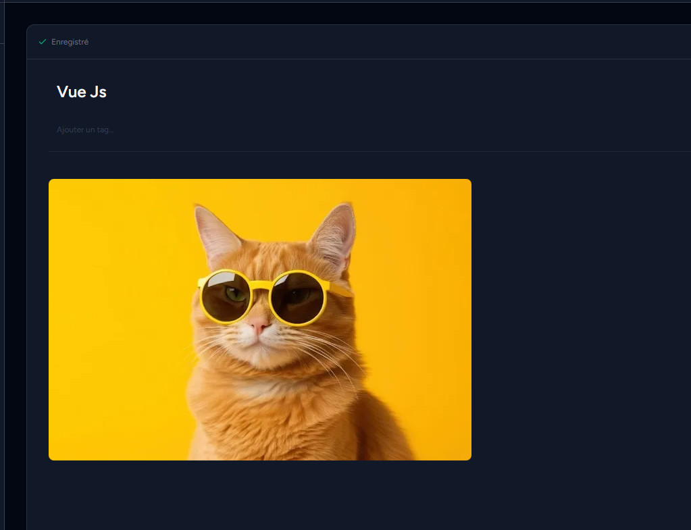

> Insertion d'images par drag & drop ou collage depuis le presse-papier — rendu directement dans l'aperçu. La taille est redimensionnable dynamiquement en glissant le coin inférieur droit de l'image, ou via la syntaxe `{width=300}` ou `{width=300 height=200}`.

---

### Commandes slash

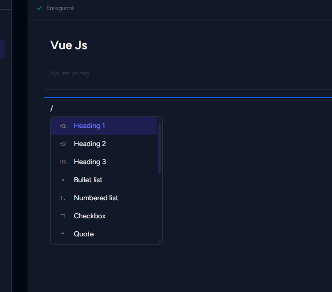

> Palette de commandes accessible avec `/` en début de ligne : titres, listes, cases à cocher, citation…

---

### Graphe de notes

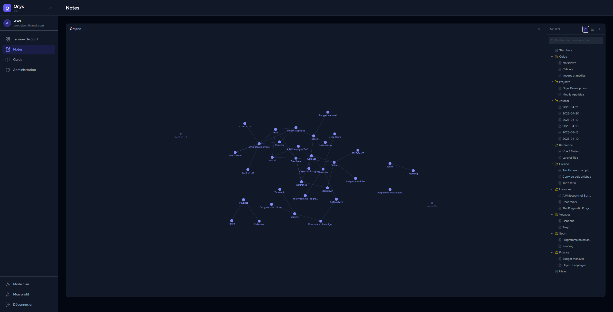

> Carte visuelle interactive de toutes les connexions entre vos notes via les liens wiki.

---

### Guide — Lexique

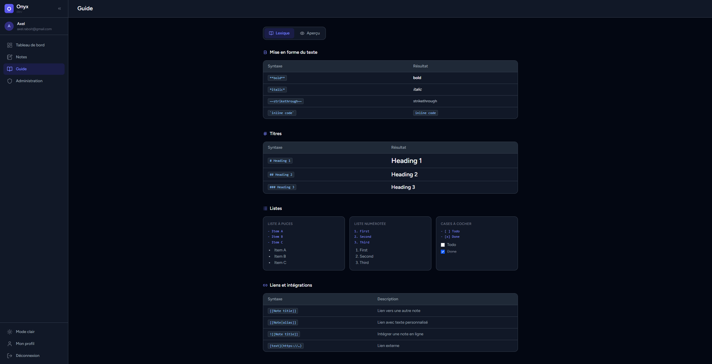
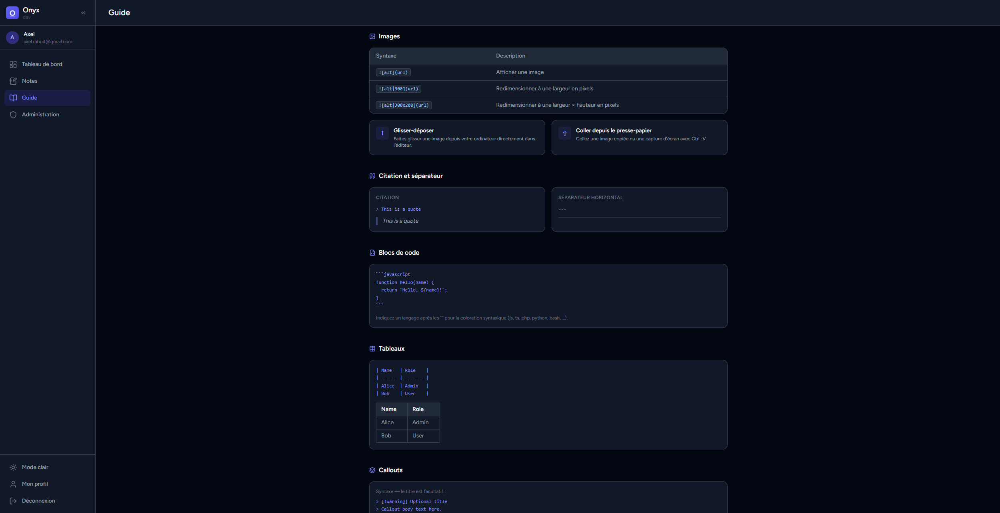
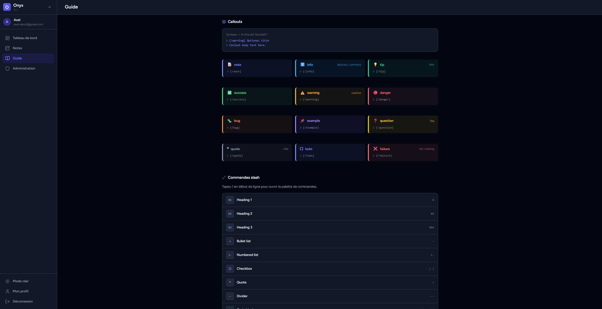
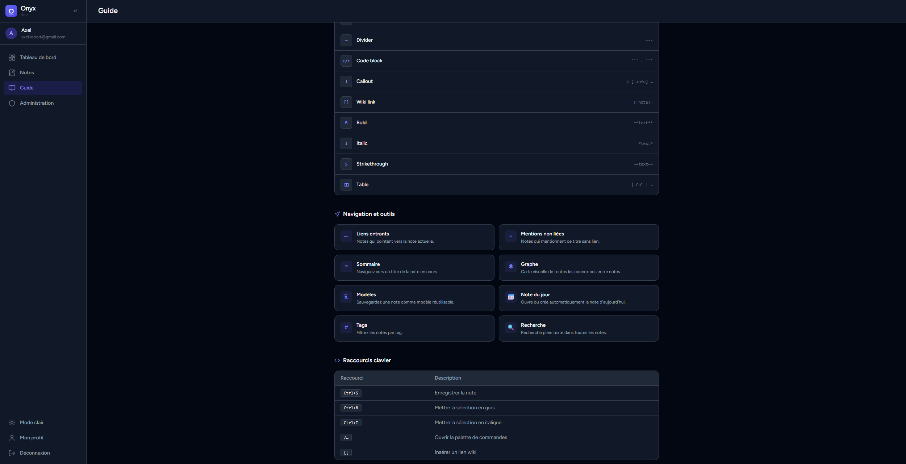

> Référence complète de la syntaxe Markdown supportée par Onyx, avec exemples côte à côte.

---

### Guide — Aperçu

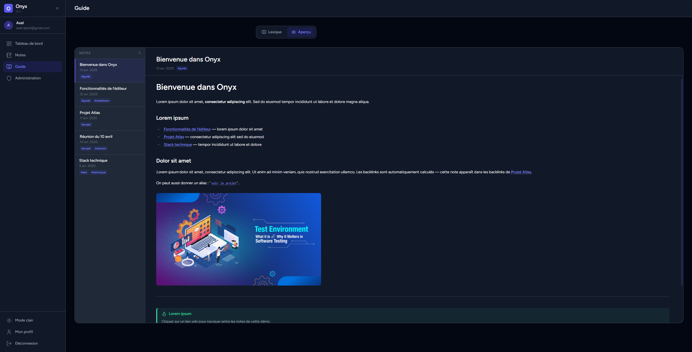

> Note de démonstration en lecture seule illustrant les capacités de rendu de l'éditeur.

---

### Profil

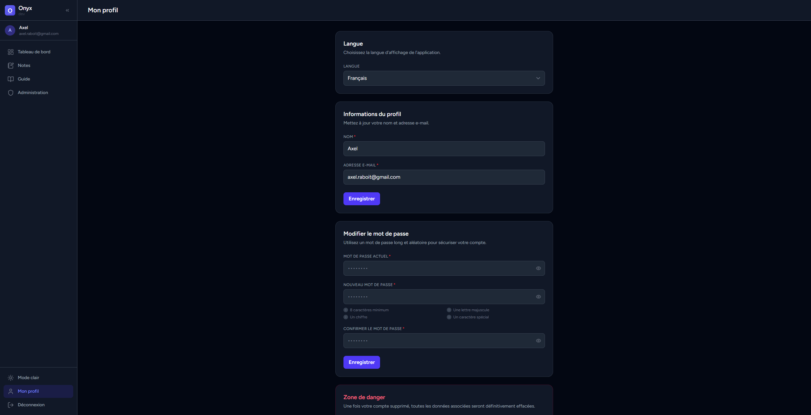

> Gestion du profil : langue d'affichage, informations personnelles, changement de mot de passe et suppression de compte.

---

### Administration

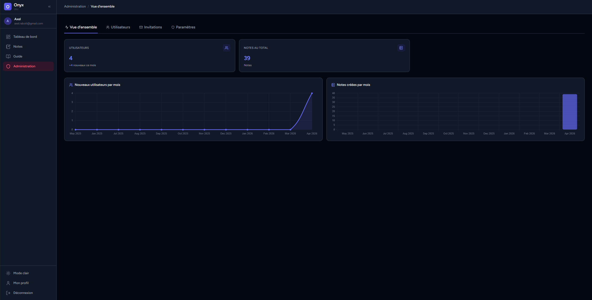

> Dashboard admin : statistiques globales (utilisateurs, notes), gestion des utilisateurs, invitations et paramètres.

---

## Architecture — SPA sans API REST

Onyx est une SPA (Single Page Application) construite sans API REST exposée. C'est le choix technique central du projet.

### Inertia.js : le pont Laravel ↔ Vue

Sans Inertia, construire une SPA nécessite soit une API REST dédiée (et donc dupliquer la logique métier), soit du rendu serveur classique (et perdre la fluidité du frontend). Inertia résout ce dilemme en servant de pont entre les deux mondes.

```
[Browser]                           [Laravel server]
     │                                      │
     │  Initial request (HTML)              │  Render layout + page component
     │ ◄──────────────────────────────────  │  + JSON data injected
     │                                      │
     │  Navigation (Inertia visit)          │
     │  ──────────────────────────────────► │  Controller → Inertia::render('Page', $data)
     │ ◄──────────────────────────────────  │  JSON response {component, props, url}
     │                                      │
     │  Vue swaps the component             │
     │  (no full page reload)               │
```

- Le contrôleur retourne `Inertia::render('Notes/Index', ['notes' => $notes])` — pas de sérialisation manuelle, pas de route API
- Vue reçoit les données comme des props directement typées
- La navigation est fluide (SPA) sans écrire une seule ligne de fetch/axios pour les données de page
- Les règles d'autorisation, la validation, les redirections restent dans Laravel — la seule source de vérité

---

## Stack technique

| Couche | Technologie |
|--------|-------------|
| Backend | Laravel 13, PHP 8.4+ |
| Frontend | Vue.js 3, Inertia.js 3 |
| Style | Tailwind CSS 4 |
| Éditeur | marked.js 18, highlight.js 11 |
| Sécurité | DOMPurify |
| Auth & permissions | Laravel Sanctum, Spatie Permissions |
| Emails | Resend |
| Build | Vite 8 |
| Base de données | PostgreSQL |

---

## Installation

### Prérequis

- PHP >= 8.4
- Composer >= 2
- Node.js / pnpm
- PostgreSQL

### Mise en place

```bash
# Cloner le dépôt
git clone https://github.com/AxelRaboit/onyx.git
cd onyx

# Copier le fichier d'environnement et configurer
cp .env.example .env
php artisan key:generate

# Installer toutes les dépendances (composer + tools + pnpm)
make install

# Exécuter les migrations
make migrate
```

### Démarrage en développement

```bash
make start
```

Lance en parallèle : le mailer (via Docker), le serveur PHP et Vite.

---

## Commandes utiles

```bash
# Développement
make start             # démarrer le mailer + serveurs de développement
make stop              # arrêter le mailer

# Base de données
make migrate           # exécuter les migrations
make migrate-fresh     # repartir de zéro (drop + migrate)
make fixtures          # migrate-fresh + seed + synchronisation des paramètres

# Qualité du code
make fix               # auto-correction (Rector, Pint, ESLint) + PHPStan
make stan              # PHPStan seul

# Tests
make test-backend            # tous les tests backend (PHPUnit)
make test-backend-unit       # tests unitaires backend uniquement
make test-backend-feature    # tests de fonctionnalité backend uniquement
make test-frontend           # tests frontend (Vitest)
make ft                      # fix + tous les tests

# Utilisateurs
make role-dev EMAIL=user@example.com   # passer un utilisateur en ROLE_DEV

# Utilitaires
make cc                # vider tous les caches
make help              # lister toutes les commandes disponibles
```

---

## Licence

MIT
